This project started out on codecrafters: [link to the challenge](https://app.codecrafters.io/courses/bittorrent/introduction)

# a BitTorrent implementation in Rust

I somehow found pretty big interest in peer-to-peer communication. I found a challenge where you implement BitTorrent by yourself from scratch on a pretty cool coding website (see above). Now I completed the main part (it's only partial on their website) and want to implement the rest of the [protocol](https://bittorrent.org/beps/bep_0003.html) (no extensions).

## current actual status:
You can download basically most of the torrents which are only single file.
This means you can go to some site like piratebay (which is quite nice for testing since there aren't so many magnet link providers with active peers out there), copy the magnet like and put it in the program like so: `cargo r --release -- download_magnet [YOUR_MAGNET_LINK]`.
It saves the current state to disk so if you want to cancel the program and start it again, it will continue where it left of.
You cannot seed yet.

## features (done / want to add)

- [X] downloading a file from the peers of the tracker found in the .torrent file
- [X] ok, I added the ut_metadata extension to support magnet_links
- [ ] seeding a file (partially done if we're already connected to a peer and he asks for a block)
- [X] storing the state of a file to disk so that you can stop a download and continue later
- [ ] retrying if none of the peers seed (currently it just iters through the peer-list once and if no one's there, no file for you)
- [ ] choking algorithm
- [ ] actually usable CLI or something

## current CLI usage

"current" because I will probably change some of it since the CLI commands were from the original challenge and are more of a sort of guidance.

```
Commands:
  decode
  info
  peers
  handshake
  download_piece
  download
  download_magnet
  help            Print this message or the help of the given subcommand(s)

Options:
  -h, --help     Print help
  -V, --version  Print version
```

Now you'll probably want to use the "download_magnet" command which looks like that:

```
Usage: codecrafters-bittorrent download_magnet [OPTIONS] <TORRENT>

Arguments:
  <MAGNET_LINK>

Options:
  -o <OUTPUT>
  -h, --help       Print help
```

If no output is provided, it will use the name found in the .torrent file.

### example

`codecrafters-bittorrent download sample.torrent -o test.txt`


Here's a very nice, compact representation of the stuff going on generated by gemini:

```mermaid
graph TD
    subgraph PeerManager [PeerManager - Orchestrator]
        PM_Init[init_from_torrent/magnet] --> PM_Run[run event loop]
        PM_Run --> PM_HandleReq[Handle ReqMsgFromPeer]
        PM_HandleReq -- NewConnection(PeerConn) --> PM_AddPeer[Add Peer to HashMap]
        PM_HandleReq -- GotBlock(ResponsePiecePayload) --> PM_WriteBlock[PieceManager.write_block]
        PM_WriteBlock -- Piece Finished (piece_index) --> PM_BroadcastHave["broadcast_peers(FinishedPiece)"]
        PM_WriteBlock -- File Finished --> PM_BroadcastFinished["broadcast_peers(FinishedFile)"]
        PM_HandleReq -- NeedBlock(RequestPiecePayload) --> PM_GetBlock[PieceManager.get_block]
        PM_GetBlock -- Block Data --> PM_SendBlock["send_peer(Block)"]
        PM_HandleReq -- NeedBlockQueue --> PM_PrepareBlocks[PieceManager.prepare_next_blocks]
        PM_PrepareBlocks -- RequestPiecePayloads --> PM_SendBlockQueue["send_peer(NewBlockQueue)"]
        PM_HandleReq -- WhatDoWeHave --> PM_SendBitfield["send_peer(WeHave)"]
        PM_HandleReq -- Extension(ExtensionMessage) --> PM_HandleExtension[Handle Extension Message]
        PM_HandleExtension -- NeedMetadataPiece --> PM_SendMetadataReq["send_peer(ExtensionData)"]
        PM_HandleExtension -- ReceivedMetadataPiece --> PM_MetadataMgr[MetadataPieceManager.add_block]
        PM_MetadataMgr -- Metadata Finished --> PM_TransitionState[Transition to Downloading]
        PM_TransitionState --> PM_BroadcastStart["broadcast_peers(StartDownload)"]
    end

    subgraph Peer [Peer - Worker]
        P_Connect[connect_from_addr/stream] --> P_Handshake[initial_handshake.shake_hands]
        P_Handshake --> P_NewPeerState[PeerState::new]
        P_NewPeerState --> P_ConnectPM[PeerState::connect_to_peer_manager]
        P_ConnectPM --> P_Run[run event loop]
        P_Run --> P_RecvStream[Receive Msg from Stream]
        P_RecvStream -- Msg::Data(PeerMessage) --> P_HandlePeerMsg[Handle PeerMessage]
        P_RecvStream -- Msg::Manager(ResMessage) --> P_HandleMgrMsg[Handle ResMessage]
        P_RecvStream -- Msg::Timeout --> P_SendKeepAlive["send_peer(KeepAlive)"]

        P_HandlePeerMsg -- Choke/Unchoke/Interested/NotInterested --> P_UpdateState[Update PeerState]
        P_HandlePeerMsg -- Have(piece_index) --> P_UpdatePeerHas[Update PeerState.has]
        P_HandlePeerMsg -- Bitfield(bitfield) --> P_UpdatePeerHas[Update PeerState.has]
        P_HandlePeerMsg -- Bitfield(bitfield) --> P_SendExtHandshake[send_extended_handshake]
        P_HandlePeerMsg -- Request(RequestPiecePayload) --> P_SendNeedBlock["send_peer_manager(NeedBlock)"]
        P_HandlePeerMsg -- Piece(ResponsePiecePayload) --> P_SendGotBlock["send_peer_manager(GotBlock)"]
        P_HandlePeerMsg -- Extended(BasicExtensionPayload) --> P_OnExtensionData[on_extension_data]
        P_OnExtensionData -- ExtensionAction --> P_HandleAction[handle_action]
        P_HandleAction -- SendPeer(PeerMessage) --> P_SendPeer[send_peer]
        P_HandleAction -- SendPeerManager(ExtensionMessage) --> P_SendExtToPM["send_peer_manager(Extension)"]

        P_HandleMgrMsg -- StartDownload --> P_SendNeedBlockQueue["send_peer_manager(NeedBlockQueue)"]
        P_HandleMgrMsg -- NewBlockQueue(Vec<RequestPiecePayload>) --> P_QueueRequests[Add to ReqQueue.to_send]
        P_HandleMgrMsg -- NewBlockQueue --> P_SetInterested["set_interested(true)"]
        P_HandleMgrMsg -- Block(ResponsePiecePayload) --> P_SendPiece["send_peer(Piece)"]
        P_HandleMgrMsg -- WeHave(BitfieldPayload) --> P_SendBitfieldToPeer["send_peer(Bitfield)"]
        P_HandleMgrMsg -- FinishedPiece(piece_index) --> P_SendHave["send_peer(Have)"]
        P_HandleMgrMsg -- FinishedFile --> P_SeverConn[sever_conn]
        P_HandleMgrMsg -- ExtensionData((ExtensionType, data)) --> P_QueueExtMsg[Add to ReqQueue.to_send]
        P_HandleMgrMsg -- ExtensionData --> P_SetInterested["set_interested(true)"]

        P_Run -- Queue Empty & Interested & Unchoked --> P_SendQueuedRequests[Send ReqQueue.to_send]
        P_SendQueuedRequests --> P_SendNeedBlockQueue["send_peer_manager(NeedBlockQueue)"]
    end

    PM_AddPeer -- PeerConn --> P_ConnectPM
    P_SendNeedBlock --> PM_HandleReq
    P_SendGotBlock --> PM_HandleReq
    P_SendNeedBlockQueue --> PM_HandleReq
    P_SendWhatDoWeHave["send_peer_manager(WhatDoWeHave)"] --> PM_HandleReq
    P_SendExtToPM --> PM_HandleReq

    PM_SendBlock --> P_HandleMgrMsg
    PM_SendBlockQueue --> P_HandleMgrMsg
    PM_SendBitfield --> P_HandleMgrMsg
    PM_BroadcastHave --> P_HandleMgrMsg
    PM_BroadcastFinished --> P_HandleMgrMsg
    PM_SendMetadataReq --> P_HandleMgrMsg
    PM_BroadcastStart --> P_HandleMgrMsg

    P_Handshake -- Peer ID, Info Hash --> PM_Init
    P_NewPeerState -- PeerState --> PM_AddPeer
    PM_GetBlock -- RequestPiecePayload --> P_HandlePeerMsg
    PM_PrepareBlocks -- Peer Has Bitfield --> P_UpdatePeerHas
    PM_GetBlock -- RequestPiecePayload --> P_HandlePeerMsg
```


