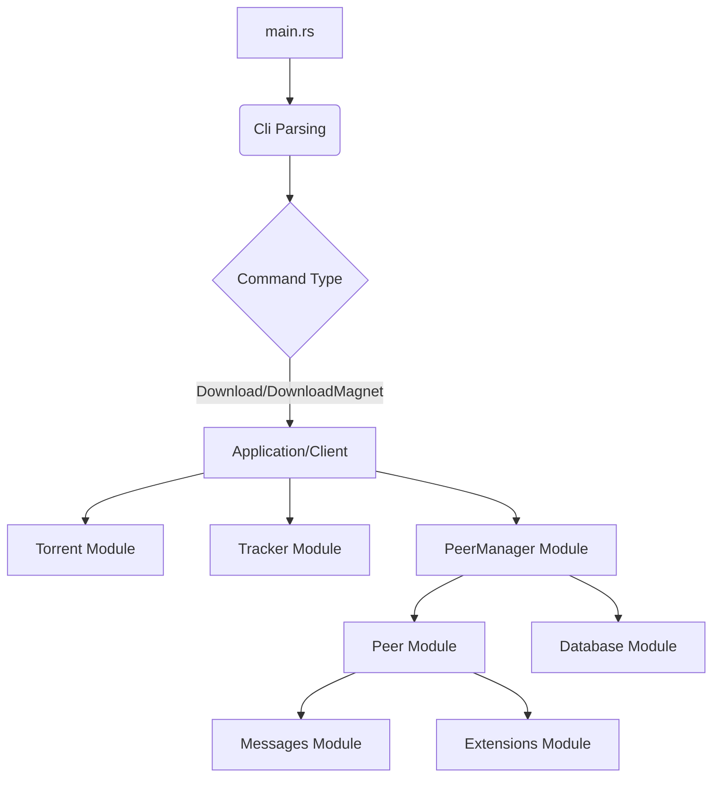

# Codebase Analysis: Confusing File Structure and Improvement Hints

## Overview of Current `src/` Structure

The `src/` directory contains the core logic of the Bittorrent client. It's organized into several modules, with some top-level files and subdirectories for related functionalities.

```
src/
├── .DS_Store
├── client.rs
├── database.rs
├── extensions/
│   ├── factory.rs
│   ├── handshake.rs
│   ├── mod.rs
│   └── magnet_links/
│       ├── metadata_piece_manager.rs
│       ├── metadata_requester.rs
│       └── mod.rs
├── lib.rs
├── main.rs
├── messages/
│   ├── client_identifier.rs
│   ├── mod.rs
│   └── payloads.rs
├── peer/
│   ├── conn.rs
│   ├── error.rs
│   ├── event_loop.rs
│   ├── extensions.rs
│   ├── handshake.rs
│   └── mod.rs
├── peer_manager/
│   ├── error.rs
│   ├── mod.rs
│   └── piece_manager/
│       ├── file_manager.rs
│       ├── mod.rs
│       └── req_preparer.rs
├── torrent.rs
└── tracker.rs
```

## Identified Confusing Aspects

1.  **`client.rs` being entirely commented out:** The `client.rs` file is completely commented out, yet it defines a `Client` struct and methods like `download_torrent` and `download_magnet`. This suggests that a `Client` abstraction was intended but is currently unused and possibly superseded by logic in `main.rs`. This creates confusion about the intended entry point and overall architecture.

2.  **Duplication of logic in `main.rs` and `client.rs`:** The `main.rs` file contains significant logic for `Download` and `DownloadMagnet` commands that closely mirrors the commented-out `start_download` logic in `client.rs`. This indicates a lack of clear separation of concerns and potential code duplication.

3.  **`lib.rs` as a re-export hub:** `lib.rs` primarily re-exports modules and specific structs/enums. While this is a common pattern, the `BittorrentClient` struct defined within `lib.rs` seems to be an incomplete or unused abstraction, further adding to the confusion about the core client structure.

4.  **`extensions` module structure:** The `extensions` module contains `factory.rs`, `handshake.rs`, and `magnet_links/`. The `magnet_links` subdirectory itself contains `metadata_piece_manager.rs` and `metadata_requester.rs`. This nesting and the generic names like `factory.rs` and `handshake.rs` (which also appears in `peer/`) make it hard to immediately grasp their specific roles and how they relate to the overall system.

5.  **`peer/` and `peer_manager/` overlap:** Both `peer/` and `peer_manager/` modules deal with peer-related logic. `peer/` contains `conn.rs`, `event_loop.rs`, `handshake.rs`, and `extensions.rs`, while `peer_manager/` contains `piece_manager/` with `file_manager.rs` and `req_preparer.rs`. The distinction between what belongs to a single `Peer` and what belongs to the `PeerManager` (which manages multiple peers) could be clearer, especially with `handshake.rs` appearing in both `peer/` and `extensions/`.

6.  **`database.rs` dependency on `Torrent` and `Metainfo`:** `database.rs` directly imports `Torrent` and `Metainfo` from the top-level `crate`. While functional, it might be more robust if `database.rs` dealt with more generic data structures or if `Torrent` and `Metainfo` were part of a more central `core` or `data` module.

7.  **Unused `BittorrentClient` struct in `lib.rs`:** The `BittorrentClient` struct in `lib.rs` is defined with `torrents` and `peer_manager` fields, but it doesn't appear to be used anywhere in the provided code snippets. This suggests an abandoned or incomplete architectural component.

8.  **Commented-out code:** There's a significant amount of commented-out code, especially in `client.rs` and `main.rs` (e.g., `DownloadPiece` command). This makes it harder to understand the current active logic and what parts are still under development or have been deprecated.

## Hints for Improvement

### 1. Re-evaluate and Consolidate Client Logic

*   **Action:** Decide on a single, clear entry point for client-side operations. Either fully implement and use the `Client` struct in `client.rs` or remove it and consolidate its responsibilities into `main.rs` or a new `application.rs` module.
*   **Hint:** If `Client` is intended to be the main orchestrator, move the `download_torrent` and `download_magnet` logic from `main.rs` into the `Client` implementation. `main.rs` should then primarily parse CLI arguments and instantiate/call methods on the `Client`.

### 2. Clarify Module Responsibilities

*   **Action:** Define clear boundaries for each module (`peer`, `peer_manager`, `extensions`, `messages`).
*   **Hint:**
    *   **`peer/`**: Should focus solely on the state and behavior of a *single* peer connection (e.g., sending/receiving messages, managing its bitfield, handshake logic specific to a single connection).
    *   **`peer_manager/`**: Should manage a collection of `Peer` instances, orchestrate piece downloading, handle overall download state, and interact with the `database`. The `piece_manager` subdirectory seems appropriate here.
    *   **`extensions/`**: Should contain logic for specific Bittorrent protocol extensions. The `magnet_links` subdirectory is a good start. The `handshake.rs` in `extensions/` might be for a generic extension handshake, while `peer/handshake.rs` is for the initial peer handshake. If so, rename to clarify (e.g., `extensions/extension_handshake.rs`).
    *   **`messages/`**: Already seems well-defined for protocol messages.

### 3. Address Code Duplication

*   **Action:** Refactor the duplicated download logic found in `main.rs` (for `Download` and `DownloadMagnet` commands) and the commented-out `client.rs`.
*   **Hint:** Extract common download orchestration logic into a shared function or a method of the `Client` struct (if re-enabled). This will make the code more maintainable and easier to understand.

### 4. Organize `extensions` Module

*   **Action:** Review the `extensions` module and its subdirectories.
*   **Hint:**
    *   Ensure `factory.rs` has a clear purpose and is not overly generic. If it's a factory for extensions, its name is fine, but its contents should reflect that.
    *   Clarify the role of `extensions/handshake.rs` versus `peer/handshake.rs`. If they serve different purposes, consider renaming for clarity (e.g., `peer/initial_handshake.rs` and `extensions/protocol_extension_handshake.rs`).

### 5. Integrate `BittorrentClient` or Remove It

*   **Action:** Decide whether the `BittorrentClient` struct in `lib.rs` is a necessary abstraction.
*   **Hint:** If it's intended to be the high-level interface for the entire application, then `main.rs` should use it, and the `Client` struct in `client.rs` might become an internal component or be merged. If it's not needed, remove it to reduce confusion.

### 6. Clean Up Commented-Out Code

*   **Action:** Remove all commented-out code that is no longer relevant or actively being worked on.
*   **Hint:** Use version control (Git) to track historical changes. Commented-out code clutters the codebase and makes it harder to read.

### 7. Improve `database.rs` Dependencies

*   **Action:** Consider if `database.rs` should have direct knowledge of `Torrent` and `Metainfo`.
*   **Hint:** If `Torrent` and `Metainfo` are core data structures, they could reside in a `core` or `data` module, and `database.rs` would then depend on that core module. This creates a clearer dependency flow.

### 8. Use Mermaid Diagrams for Complex Interactions

*   **Action:** For complex interactions, such as the flow between `Client`, `PeerManager`, and `Peer`, consider adding Mermaid diagrams to `todo.md` or other documentation.

Here's a high-level diagram of a potential improved structure:



This diagram illustrates a more centralized `Application` or `Client` module orchestrating the main components.

## Next Steps

I've completed the analysis and created this `todo.md` file. Please review it and let me know if you'd like any changes or have further questions.